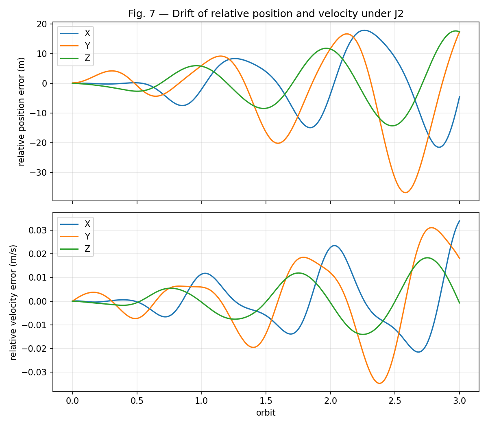
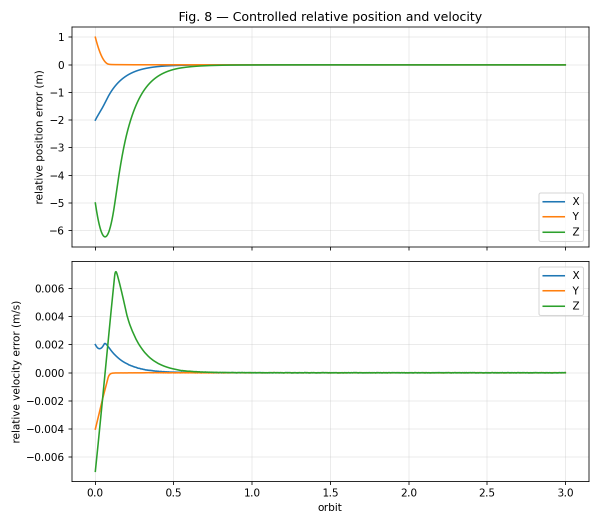
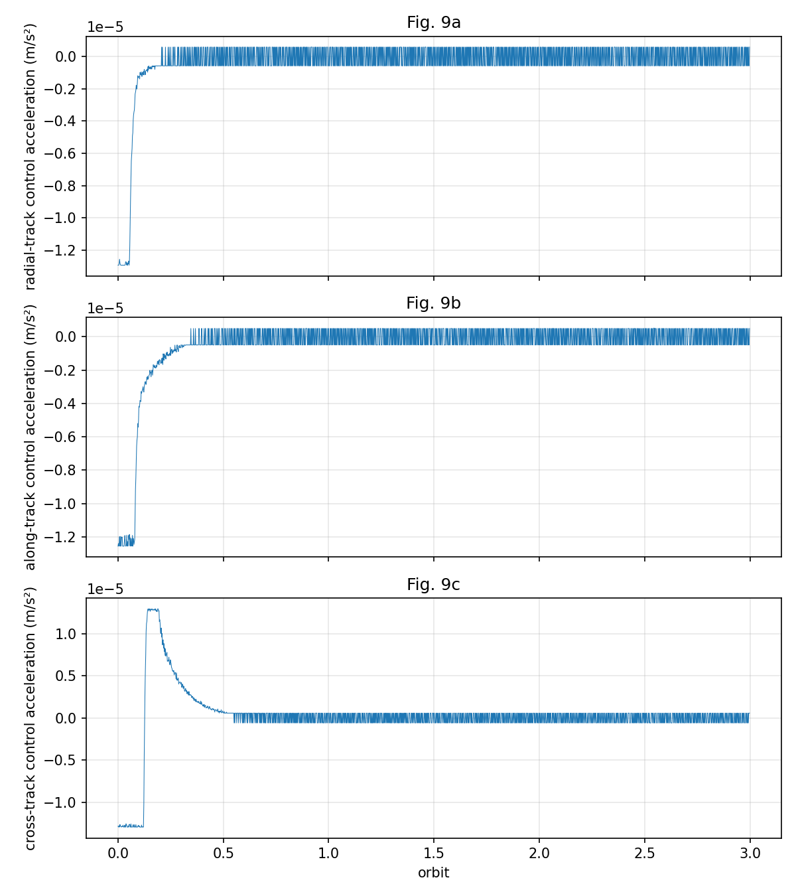
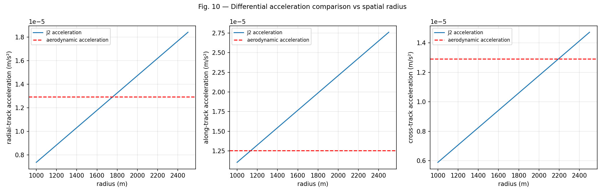
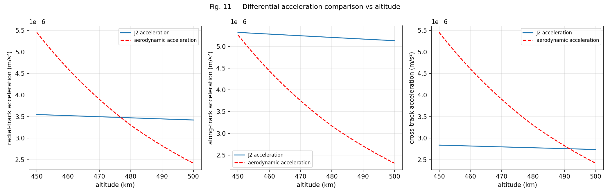

# Satellite Formation Keeping Using Differential Lift and Drag Under J2 Perturbation

> **Based on:** Shao, X., Song, M., Wang, J., Zhang, D. & Chen, J. (2017). "Satellite formation keeping using differential lift and drag under J2 perturbation." *Aircraft Engineering and Aerospace Technology*, 89(1), 11–19. [doi:10.1108/AEAT-06-2015-0168](http://dx.doi.org/10.1108/AEAT-06-2015-0168)

This repository reproduces the simulations and key results from the paper above. It implements a complete formation-keeping pipeline for two CubeSats in low Earth orbit (~400 km), where differential aerodynamic forces generated by adjustable flat plates replace traditional thrusters.

## Overview

In LEO, residual atmospheric drag is significant enough to be exploited for propellant-free formation control. Each satellite carries five flat plates whose tilt angles modulate the aerodynamic lift and drag, producing differential accelerations between a chief and deputy satellite. A Lyapunov-based nonlinear controller drives the tracking error to zero despite J2 gravitational perturbation and actuator saturation.

The simulation reproduces **Figures 7–11** from the paper across three modes:

| Mode | Description | Figures |
|------|-------------|---------|
| 1 | Uncontrolled formation drift under J2 | Fig. 7 |
| 2 | Closed-loop formation keeping | Fig. 8, 9 |
| 3 | Key factor analysis (radius & altitude trade-offs) | Fig. 10, 11 |

## Project Structure

```
├── main.py                    # Simulation driver (3 modes)
├── validate.py                # 77 validation tests against the paper
├── visualization.py           # Plotting routines for Figures 7–11
├── requirements.txt           # Python dependencies
├── cubesat_sim/
│   ├── __init__.py
│   ├── constants.py           # Physical constants & orbital params (Tables II–III)
│   ├── aerodynamics.py        # Free-molecular-flow aero model (Eq. 1–2)
│   ├── atmosphere.py          # US Standard Atmosphere 1976
│   ├── orbital.py             # Gauss VE propagation with J2 (Eq. 5–6)
│   ├── relative_motion.py     # Clohessy-Wiltshire equations (Eq. 7–9)
│   ├── controller.py          # Lyapunov feedback controller (Eq. 10–14)
│   └── actuators.py           # 5-plate actuator model (Eq. 3, 15, Table I)
└── figures/                   # Generated output plots
```

## Key Components

**Aerodynamic Model** — Free-molecular-flow theory (kinetic theory of gases) computes pressure and shear on flat plates as a function of incidence angle, atmospheric density, temperature, and molecular weight.

**Actuator Configuration** — Five plates in three groups (Table I) produce independent radial, along-track, and cross-track differential accelerations by adjusting tilt angles. Maximum accelerations are ~1.3 × 10⁻⁵ m/s².

**Orbit Propagation** — Gauss Variational Equations with J2 perturbation, using modified equinoctial elements internally for singularity-free integration near circular orbits.

**Relative Motion** — Clohessy-Wiltshire linearized equations in the chief's LVLH (local-vertical local-horizontal) frame provide the reference trajectory and the controller's dynamic model.

**Lyapunov Controller** — A globally asymptotically stable feedback law (Eq. 12) with gains K_r = 3 × 10⁻⁵·I and K_v = 2 × 10⁻²·I drives the formation tracking error to zero.

## Quick Start

```bash
pip install -r requirements.txt

# Run all three simulation modes and generate Figures 7–11
python main.py 1 2 3

# Run only the controlled formation keeping (Figures 8–9)
python main.py 2

# Run the full validation suite (77 tests)
python validate.py
```

Output figures are saved to `figures/`.

## Simulation Parameters

From the paper's Tables II and III:

| Parameter | Value |
|-----------|-------|
| Chief semi-major axis | 6778.137 km (altitude ≈ 400 km) |
| Eccentricity | 0 (circular orbit) |
| Inclination | 96.4522° (sun-synchronous) |
| Satellite mass | 10 kg |
| Initial relative position | [82.50, −930.46, 55.27] m |
| Initial relative velocity | [−0.17, −0.04, 0.29] m/s |
| Tracking error (position) | [2, −1, 5] m |
| Tracking error (velocity) | [−0.002, 0.004, 0.007] m/s |
| GPS noise (position) | σ = 0.01 m |
| GPS noise (velocity) | σ = 0.0001 m/s |
| Simulation duration | 3 orbits (~16,660 s) |

## Results

### Figure 7 — Uncontrolled Drift Under J2

Without control, J2 perturbation causes the relative position to drift up to ~35 m over 3 orbits, with the along-track (Y) axis showing the largest secular component. Velocity errors reach ~0.035 m/s.



### Figure 8 — Controlled Relative Position and Velocity

With the Lyapunov controller active, all three position errors (initial: X = −2 m, Y = +1 m, Z = −5 m) converge within approximately half an orbit (~46 minutes). After convergence, tracking errors remain at essentially zero for the full 3-orbit duration.



### Figure 9 — Control Accelerations

The actuators initially saturate at their maximum limits (~1.3 × 10⁻⁵ m/s²) during the first ~0.1 orbits to correct the initial tracking error, then decay to near-zero steady-state levels. All accelerations remain within the aerodynamic actuator authority.



### Figure 10 — Differential Acceleration vs Spatial Radius

J2 differential acceleration grows linearly with formation spatial radius while the aerodynamic actuator limit is fixed. The crossover defines the maximum feasible formation size (~1.5 km for radial/cross-track, ~1 km for along-track at 400 km altitude).



### Figure 11 — Differential Acceleration vs Altitude

As altitude increases, atmospheric density drops exponentially, reducing aerodynamic control authority. The J2 acceleration remains relatively constant. The method is viable below ~480 km where aerodynamic forces dominate.



## Validation

The test suite (`validate.py`) runs **77 checks** against the paper's equations, tables, and expected behaviors:

```
=== 1. Constants (Table II, Table III) ===
  PASS  Chief a = 6778.137 km
  PASS  Chief e = 0
  PASS  Chief i = 96.4522 deg
  PASS  Chief omega = 90 deg
  PASS  Table III: x0 = 82.50 m
  PASS  Table III: y0 = -930.46 m
  PASS  Table III: z0 = 55.27 m
  PASS  Table III: xdot0 = -0.17 m/s
  PASS  Table III: ydot0 = -0.04 m/s
  PASS  Table III: zdot0 = 0.29 m/s
  PASS  Satellite mass = 10 kg
  PASS  Kr = 3e-5 * I3
  PASS  Kv = 2e-2 * I3

=== 2. Atmosphere at 400 km ===
  PASS  rho(400km) ~ 2.803e-12 kg/m³
  PASS  T(400km) ~ 995.8 K
  PASS  M(400km) ~ 15.98 g/mol

=== 3. Aerodynamics (Eq. 1-2) ===
  PASS  Orbital velocity ~ 7669 m/s
  PASS  Speed ratio S ~ 7.5 (hypersonic)
  PASS  At θ=45°: Fd > Fl (drag dominates for shear-dominated flow)
  PASS  Fl > 0 (lift is positive)
  PASS  Fd > 0 (drag is positive)
  PASS  Drag increases with theta (10° < 30° < 45°)

=== 4. Actuators (Table I, Eq. 3) ===
  PASS  Table I: Ka = N*k*A = 1*2*2 = 4
  PASS  Table I: Kb = N*k*A = 2*1*0.5 = 1
  PASS  Table I: Kc = N*k*A = 2*2*1 = 4
  PASS  ax_max ~ az_max (same K, both lift-based)
  PASS  ax_max > ay_max (lift*4 > drag*1 at these conditions)
  PASS  Max accels are order 1e-5 m/s² (paper: 9.17e-6 to 1.11e-5)
  PASS  Angle inversion round-trip group a: error < 1%
  PASS  Angle inversion round-trip group b: error < 1%
  PASS  Angle inversion round-trip group c: error < 1%

=== 5. Orbit Propagation (Eq. 5-6, J2) ===
  PASS  Propagation completes for 3 orbits
  PASS  SMA variation < 0.1% over 3 orbits
  PASS  RAAN regression rate matches analytical J2 prediction (within 5%)
  PASS  Orbit altitude stays near 400 km (±50 km)

=== 6. CW Equations (Eq. 7-9) ===
  PASS  A1[0,0] = 3ω² (Eq. 9)
  PASS  A1[2,2] = -ω² (Eq. 9)
  PASS  A2[0,1] = 2ω (Eq. 9)
  PASS  A2[1,0] = -2ω (Eq. 9)
  PASS  Φ(0) = I₆ₓ₆
  PASS  CW z-motion: z(T/2) = -z₀ (simple harmonic)

=== 7. Lyapunov Controller (Eq. 10-14) ===
  PASS  V̇ ≤ 0 for random state (trial 0)
  PASS  V̇ ≤ 0 for random state (trial 1)
  PASS  V̇ ≤ 0 for random state (trial 2)
  PASS  V̇ ≤ 0 for random state (trial 3)
  PASS  V̇ ≤ 0 for random state (trial 4)
  PASS  V̇ ≤ 0 for random state (trial 5)
  PASS  V̇ ≤ 0 for random state (trial 6)
  PASS  V̇ ≤ 0 for random state (trial 7)
  PASS  V̇ ≤ 0 for random state (trial 8)
  PASS  V̇ ≤ 0 for random state (trial 9)
  PASS  V̇ ≤ 0 for random state (trial 10)
  PASS  V̇ ≤ 0 for random state (trial 11)
  PASS  V̇ ≤ 0 for random state (trial 12)
  PASS  V̇ ≤ 0 for random state (trial 13)
  PASS  V̇ ≤ 0 for random state (trial 14)
  PASS  V̇ ≤ 0 for random state (trial 15)
  PASS  V̇ ≤ 0 for random state (trial 16)
  PASS  V̇ ≤ 0 for random state (trial 17)
  PASS  V̇ ≤ 0 for random state (trial 18)
  PASS  V̇ ≤ 0 for random state (trial 19)
  PASS  Lyapunov V decreases monotonically (unsaturated CW)
  PASS  Controller converges to < 0.01m in 1 orbit (unsaturated)

=== 8. Mode 1: Uncontrolled J2 Drift (Fig. 7) ===
  PASS  Mode 1 runs for 3 orbits
  PASS  Fig 7: Y-drift is largest axis (secular along-track drift)
  PASS  Fig 7: Position errors are order 10-100 m over 3 orbits
  PASS  Fig 7: Velocity errors are order 0.01-0.1 m/s over 3 orbits

=== 9. Mode 2: Controlled Formation (Fig. 8-9) ===
  PASS  Mode 2 runs successfully
  PASS  Fig 8: Error decreases in first half-orbit
  PASS  Fig 8: Z-axis error converges to < 10 m
  PASS  Fig 9: ax within limit
  PASS  Fig 9: ay within limit
  PASS  Fig 9: az within limit

=== 10. Mode 3: Key Factors (Fig. 10-11) ===
  PASS  Fig 10: J2 accel increases with spatial radius
  PASS  Fig 10: J2 accel scales linearly with radius (ratio ≈ 2.5)
  PASS  Fig 11: Aero accel decreases with altitude
  PASS  Fig 11: J2 accel decreases with altitude

============================================================
  Results: 77 passed, 0 failed out of 77
============================================================
```
